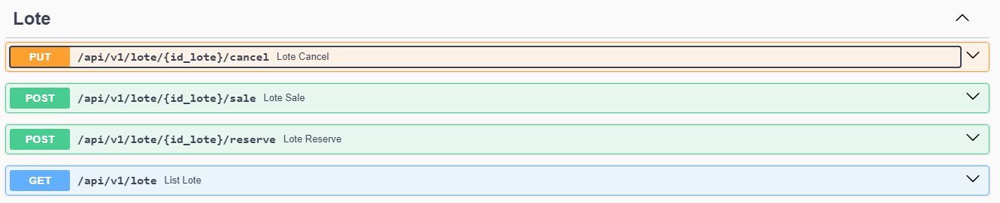
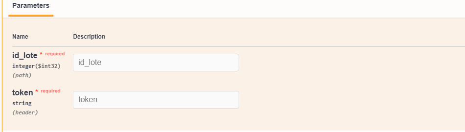
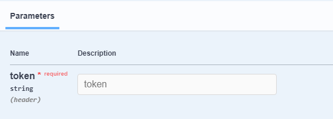

# Imobilt


## Description

- This project was developed as a way to apply my knowledge in building microservices in Java using Spring boot and as an academic project.
- **Academic Data:**
  - **Institution:** Universidade Federal Rural de Pernambuco - Unidade Academica de Serra Talhada (UFRPE-UAST)
  - **Program:** Information Systems
  - **Course:** DataBase Project
  - **Docente:** Prof. Héldon José Oliveira Albuquerque

## Project Documentation
* The project documentation was made using Swagger UI.
  * [Link to documentation](http://localhost:8081/swagger-ui/index.html)
    * ***Obs:*** *As the server is local, the api must be running.*
  * Below, some images and details from the project documentation:

### Lote

* **EndPoints:**
  * **PUT** /api/v1/lote/(id_lote)/cancel
  
    * **Payload**
      ```shell
      {
        "observation": "string"
      }
      ```
    * **Response**
      ```shell
      {
        "id": 0
      }
      ```
  * **POST** /api/v1/lote/(id_lote)/sale
    
    * **Payload**
      ```shell
       {
         "client_id": 0
       }
      ```
    * **Response**
      ```shell
      {
        "id": 0
      }
      ```
   * **POST** /api/v1/lote/(id_lote)/reserve
  
      * **Payload**
        ```shell
         {
           "client_id": 0
         }
        ```
      * **Response**
        ```shell
        {
          "id": 0
        }
        ```
  * **GET** /api/v1/lote
    <br>
  
    * **Response**
      ```shell
        { 
            "additionalProp1": [
                {
                    "id": 0,
                    "lote": "string",
                    "enterprise": {
                      "id": 0,
                      "description": "string"
                    },
                   "block": "string"
                }
            ],
            "additionalProp2": [
               {
                 "id": 0,
                 "lote": "string",
                 "enterprise": {
                   "id": 0,
                   "description": "string"
                 },
                 "block": "string"
               }
            ]
        }
      ```
